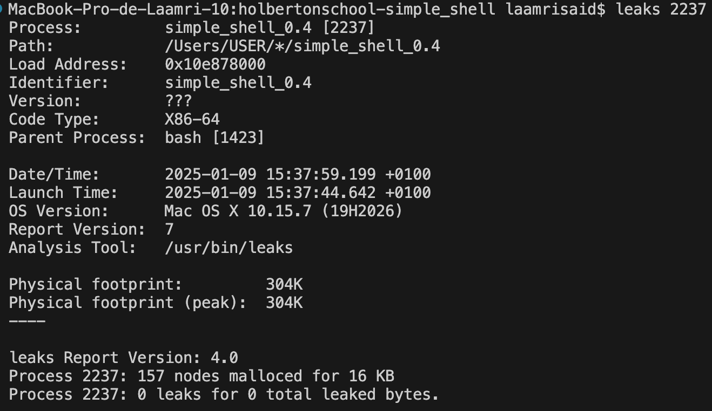

# Simple shell

## Description
Simple shell est un interpréteur de commandes UNIX simple
## Compilation
Utilisez la ligne de commande suivante pour compiler tous les fichiers avec l'extension .c: 
**gcc -Wall -Werror -Wextra -pedantic -std=gnu89 `*.c` -o simple_shell**
## Exigences (requirements)
La compilation de nos fichiers sources sera effectué sur un système d'exploitation Ubuntu 20.04 LTS. 
Nos programmes répondent aux exigences de style Betty. Ils ont été vérifiés avec betty-style.pl et betty-doc.pl
## Exemples d'utilisation
**Mode interacif:** 
MacBook-Pro-de-Laamri-10:holbertonschool-simple_shell laamrisaid$ ./Simple_shell 
$ ls 
AUTHORS commands.c Images_README man_1_simple_shell README.md shell.h utils.c Simple_shell.c 
$ 
**Mode non-interactif:** 
MacBook-Pro-de-Laamri-10:holbertonschool-simple_shell laamrisaid$ echo -e "/bin/ls" | ./Simple_shell 
AUTHORS commands.c Images_README man_1_simple_shell README.md shell.h utils.c Simple_shell.c 
## Tests
Vérification des éventuelles fuites de mémoire avec l'utilisation de **leaks**:
1. Compiler le programme à vérifier. simple_shell.c, par exemple:
**gcc -Wall -Werror -Wextra -pedantic -std=gnu89 simple_shell.c -o simple_shell**
3. Exécuter le programme en arrière-plan en utilisant l'opérateur &:
**./simple_shell &**
4. Trouver l'ID du programme (simple_shell.c) en utilisant la commande ps. Ici **2237**
5. Utiliser leaks avec le PID du programme. 
commande leaks 2237 
   

